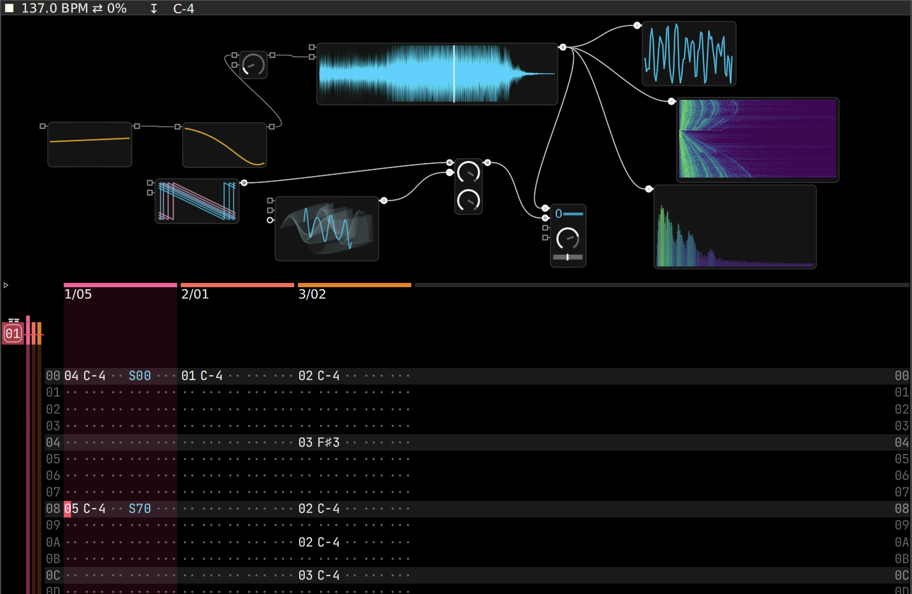

# Signals
Signals is a lively environment for real-time musical synthesis, 100% human-written in Smalltalk. It includes:
* a modular framework for digital signal processing of audio signals;
* a dataflow-oriented visual programming environment for building synthesizers and effects;
* a tracker for sequencing synthesizers and effects

### Features
The following are some of the features of Signals:
* samples and multisamples
* antialiased oscillators (with PolyBLEP/PolyBLAP)
* antialiased wavetables (bandlimited on-the-fly via inverse FFT)
* classic FM with any number of carriers or modulators
* LFOs and many types of envelopes
* digital filters based on biquads and SVF
* virtual analog filters
* wave shapers (decimator, overdrive, tape/tube saturation, wavefolder, etc)
* effects (reverbs, delays, flanger, phaser, chorus, pitch shifter, etc)
* visualizations (oscilloscope, spectrogram, spectrum analyzer, vectorscope)
* modules to mix and pan, stereo widening, compressor, limiter, EQ, etc
* internal oversampling when needed (typically in modules with nonlinearities that are more susceptible to aliasing)
* all control parameters are modulatable by design
* multiple approaches to control by modulation modules (envelopes, LFOs) or by tracker sequencing
* audio routing through buses (send effects, etc)
* portamento and legato support
* microtuning with arbitrary tuning systems per track
* all code in pure Smalltalk, and available all the time for browsing or modification while running (lively environment)

### Smalltalk
The system is based on Smalltalk-80, specifically [Cuis Smalltalk](https://github.com/Cuis-Smalltalk/Cuis-Smalltalk-Dev). It is multiplatform and runs with the [OpenSmalltalk virtual machine](https://github.com/OpenSmalltalk/opensmalltalk-vm).

As many systems based on Smalltalk, it comes complete with an environment for interactive programming, blurring the distinction between user and programmer (or musician and programmer in this case). It contains a complete development environment that allows you to browse classes, inspect objects, debug, and change anything 'live' while it is running.

### Samples
Some free samples and multisamples are included in the data/ git submodule. The multisamples are taken from public domain sound fonts.

### Installing
Clone the git repo with --recurse-submodules in order to clone the data/ submodule:

git clone --recurse-submodules https://github.com/len/Signals

Then open a latest Cuis image, and load the package Tracker.pck.st. It will take one or two minutes to install some multisamples and generate some wavetables (it prints progress to the Transcript), and it will load the JetBrains monospaced font included with Cuis and set the theme to a new darker theme (you might need to close the opened windows if they don't update correctly).

Finally, open a FileList, go to Signals/data/projects/ and choose any of the examples. You can load it from the menu with 'open in tracker'. Also from the FileList you can import samples in WAV format to the sample library to make them available from the instrument editor menu.

### The tracker window

On the screenshot above you can see an open tracker window. At the top there is the "instrument editor" that contains a patch of modules connected by wires (an instrument, or possibly an effect or other kind of audio processing patch). Each module morph contains controls (like knobs, sliders, a wave, etc) that can be changed with mouse scroll or the arrow keys (with shift pressed to do fine adjustments). The instrument editor is fully zoomable, you can zoom in/out with Cmd-mouse-scroll and pan by mouse-dragging the background. The instrument editor shows the patch for the instrument at current cursor position in the pattern editor below it; you have to move the cursor to see the different patches, or enter a new instrument number to create a new empty patch.

At the bottom left there is the "sequencer" or "arranger", that contains the list of patterns to be played. And at the bottom right the "pattern editor" that shows the current pattern and allows you to edit the triggers (notes and effect commands, like a typical tracker). Each track contains the following columns: instrument number, note, velocity, fx1 and fx2. The following are the fx commands currently implemented:
* Cxy cut to velocity x (0 = minimum, F = maximum) after y/12 of a line
* Rxy retrigger every y/12 of a line, and change velocity according to x (see below)
* Gxx glide to note in xx/16 lines (01 = 1/16 of a line, 10 = 1 line, FF = almost 16 lines)
* Uxx / Dxx slide note up/down by xx/16 semitones
* +xx / -xx finetune note up/down by xx/256 of a note depending on the selected tuning (0 = no change, 80 = half note, FF = almost 1 note)
* Sxx set sample start offset
* >xy / <xy slide to play forward/backwards at speed x/8 (4 = half speed, 8 = normal, C = doubel speed, F = 8x) in y lines
* /xy / \xy forward/backward stroke, move sample playhead by x lines in y lines
* Lxx set instrument volume level to xx (00 = minimum, FF = maximum)
* Pxx set instrument pan (00 = left, 80 = center, FF = right)
* Ixx / Oxx adjust instrument volume level up/down
* Jxx / Kxx adjust instrument pan left/right
* 0xx to 9xx set control input
* Fxx set BPM to xx
* Qxx delay trigger by xx/256 of a line (00 = no delay, FF = almost a full line)
* Yxx set the probability of playing the trigger (00 = never, FF = always)

Retrigger velocity change:
* 0 no velocity change
* 1, 2, 3, 4, 5 reduce velocity by substracting 1/32, 1/16, 1/8, 1/4, 1/2
* 6, 7 scale down velocity multuplying by 2/3, 1/2
* 8 no velocity change
* 9, A, B, C, D increase velocity by adding 1/32, 1/16, 1/8, 1/4, 1/2
* E, F scale up velocity multiplying by 3/2, 2

Commands Rxy and Cxy interpret the nibble x as a time span in units of 1/12 of a line (0 = instantly, C = 1 line).

### Hotkeys and keyboard mapping
Trackers are heavily keyboard-oriented. The following hotkeys are the most commonly used (in PC, Command and Option are Control and Alt).

Global (tracker window):

* Cmd-o and Cmd-s open and save a project (the whole song with instruments and patterns, including all samples used)
* Cmd-e switch the upper pane between instrument editor (the DSP graph) and instrument rack (just the modules in a row)
* Cmd-[/] change octave for notes input with the computer keyboard

Pattern editor:

* Space play sequence from cursor line and loop it (don't loop with Opt), or stop if currently playing
* Enter play trigger or selection and loop it (don't loop with Opt)
* Opt-m toggle track mute
* Opt-s toggle track solo
* Cmd-m toggle track mask in current sequence position
* Cmd-t insert new track after current track (Cmd-T delete current track)
* Cmd-n insert new pattern after current pattern (Cmd-N delete current pattern)
* Opt-Left/Right go to next track to the left/right
* Shift-Opt-Left/Right move current track to the left/right
* Opt-Up/Down go to previous/next pattern in the sequence
* Shift-Opt-Up/Down move current trigger or selection one line up/down
* ]/[ transpose trigger or selection one octave up/down
* }/{ transpose trigger or selection one note up/down
* Cmd-l set pattern length
* Cmd-b set pattern LPB (lines per beat)
* Cmd-u set track tuning system (default 12-TET)
* Cmd-r rename instrument
* Cmd-+/- increase/decrease pattern editor font size
* Cmd-' show/hide FX columns

Instrument editor:

* Esc or click on background to open menu to add new modules to the patch
* Mouse-drag background for panning
* Cmd-mouse-scroll zoom
* Backspace delete module or wire under the mouse
* Mouse-drag from a module output pin to another module input pin to add a wire
* ` to center and zoom the patch to make it fit the available space
* Mouse-scroll on a control wire to change modulation depth

Modules:
* Cmd-b and Cmd-i browse and inspect module under the mouse

You can use the computer keyboard to input notes in the tracker or trigger notes in realtime in the instrument editor while the tracker is playing. Transpose one octave up with Cmd-] and down with Cmd-[.

### Citing Signals
If you use Signals in a non-trivial part of your research please consider citing it as follows:

	@manual{Signals,
	  key = "Signals",
	  author = "Luciano Notarfrancesco",
	  title = "{The Smalltalk Signals Project}",
	  year = 2025,
	  url = "\url{https://github.com/len/Signals}",
	}

