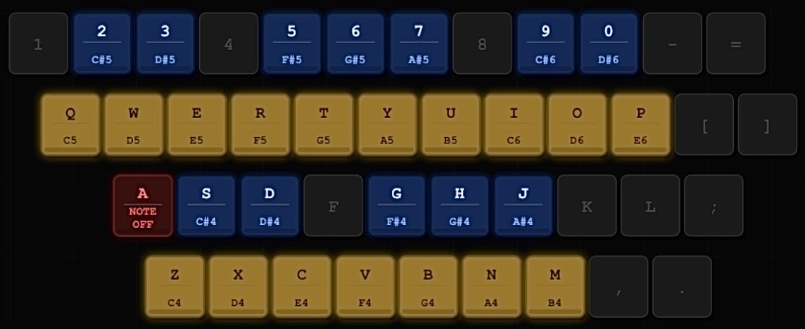

# Signals
Signals is a lively environment for real-time musical synthesis. It includes:
* a modular framework for digital signal processing of audio signals;
* a dataflow-oriented visual programming environment for building synthesizers and effects;
* a tracker for sequencing synthesizers and effects

### Features
The following are some of the features of Signals:
* samples and multisamples
* antialiased oscillators (with PolyBLEP/PolyBLAP)
* antialiased wavetables (bandlimited on-the-fly)
* LFOs and many types of envelopes
* digital filters based on biquads and SVF
* virtual analog filters
* wave shapers (decimator, overdrive, tape/tube saturation, wavefolder, etc)
* effects (reverbs, delays, flanger, phaser, chorus, etc)
* visualizations (oscilloscope, spectrogram, spectrum analizer, vectorscope)
* modules to mix and pan, stereo widening, compressor, limiter, EQ, etc
* internal oversampling when needed (typically in modules with nonlinearities that are more suceptible to aliasing)
* all control parameters are modulatable by design
* multiple approaches to control by modulation modules (envelopes, LFOs) or by tracker sequencing
* audio routing through buses (send effects, etc)
* portamento and legato support
* all code in pure Smalltalk, and available all the time for browsing or modification while running (lively environment)

### Smalltalk
The system is based on Smalltalk-80, specifically [Cuis Smalltalk](https://github.com/Cuis-Smalltalk/Cuis-Smalltalk-Dev). It is multiplatform and runs with the [OpenSmalltalk virtual machine](https://github.com/OpenSmalltalk/opensmalltalk-vm).

As many systems based on Smalltalk, it comes complete with an environment for interactive programming, blurring the distinction between user and programmer (or musician and programmer in this case). It contains a complete development environment that allows you to browse classes, inspect objects, debug, and change anything 'live' while it is running.

### Samples
Some free samples and multisamples are included in the samples/ directory (it's a git submodule). The multisamples are mostly adapted from public domain sound fonts.

### Hotkeys and keyboard mapping
Trackers are heavily keyboard-oriented. The following hotkeys are the most commonly used (in PC, Command and Option are Control and Alt).

Pattern editor:

* Space play sequence from cursor line and loop it (don't loop with Opt), or stop if currently playing
* Enter play trigger or selection and loop it (don't loop with Opt)
* \ toggle track mute (Cmd-\ toggle track solo)
* Cmd-m toggle track mask in current sequence position
* Cmd-t insert new track after current track (Cmd-T delete current track)
* Cmd-n insert new pattern after current pattern (Cmd-N delete current pattern)
* Opt-Left/Right go to the left/right track
* Shift-Opt-Left/Right move current track to the left/right
* Opt-Up/Down go to previous/next pattern in the sequence
* Shift-Opt-Up/Down move current pattern to the previous/next position in the sequence
* ]/[ transpose trigger or selection one octave up/down
* }/{ transpose trigger or selection one semitone up/down
* Cmd-[/] change octave for entering notes with the computer keyboard
* Cmd-f set tracker BPM
* Cmd-g set tracker swing
* Cmd-l set pattern length
* Cmd-b set LPB (lines per beat)
* Cmd-r rename instrument
* Cmd-o and Cmd-s open and save a project (the whole song)
* Cmd-i and Cmd-e import and export an instrument
* Cmd-j toggle the lower pane (the pattern editor and sequencer)
* Cmd-+/- increase/decrease pattern editor font size

Instrument editor:

* Esc open menu to add new modules to the patch
* Mouse-drag panning
* Cmd-mouse-scroll zoom
* Backspace delete module or wire under the mouse
* Mouse-drag from a module output pin to another module input pin to add a wire
* ` to center and zoom the patch to make it fit the available space

You can use the computer keyboard to input notes in the tracker or trigger notes in realtime in the instrument editor while the tracker is playing. Transpose one octave up with Cmd-] and down with Cmd-[.

### Citing Signals
If you use Signals in a non-trivial part of your research please consider citing it as follows:

	@manual{Signals,
	  key = "Signals",
	  author = "Luciano Notarfrancesco",
	  title = "{The Smalltalk Signals Project}",
	  year = 2025,
	  url = "\url{https://github.com/len/signals}",
	}

